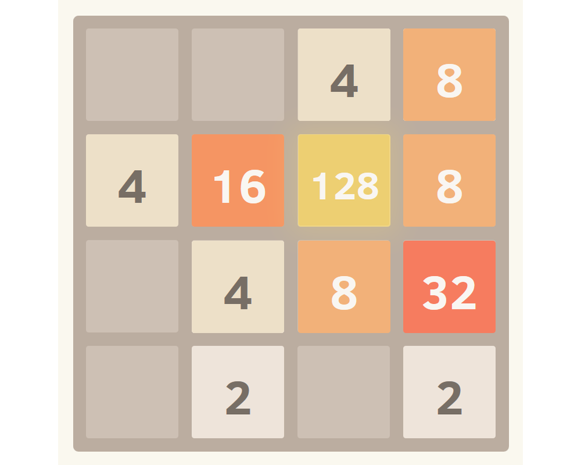

# Game 2048

> 2048 is a puzzle-type game developed in March 2014 by Gabriele Cirulli.

To start playing, just run `game2048/display_grid.py` from your IDE.

You can select the size and theme (default, chemistry or alphabet).